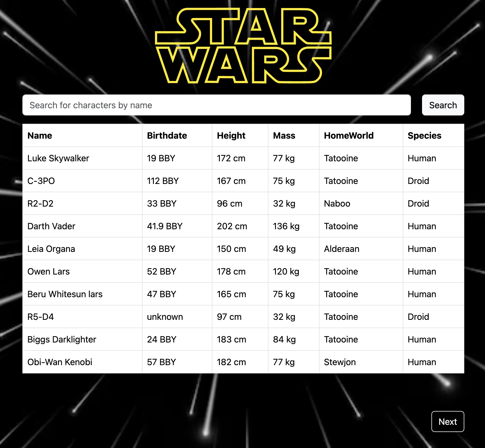

# StarWars Database

*An app with a searchable table to display information on all StarWars characters using the https://swapi.py4e.com/api/ API. Written in React/TS, utilizing bootstrap and axios libraries.*

View it [here](https://swapi-1kd.pages.dev/)

## Summary
This app allows users to navigate through a searchable table of all StarWars characters.

The purpose for creating this app was to gain more hands-on experience in working with APIs by testing and troubleshooting tools (Postman), error handling, and retrieving data and presenting it on the front end.

I encountered was that the initial server response from the API provided me with references to other API endpoints. Instead of giving me the direct values for 'homeworld' and 'species'. This required subsequent API calls based on the initial response data.

I decided to make API requests in the async-await context, using Axios to handle API request, for a cleaner code structure and simpler syntax. I found the Promise.all method as the most efficient way to get the information since it enabled me to make concurrent API request ( per each character ) using less lines of code. 

Managing multiple API requests required a thorough understanding of the returned response bodies. I heavily relied on the Postman API platform to test multiple API calls to make sure the response properties were defined and existed in the correct scope.

## Author
- John Clampet: FullStack Software Developer
- [LinkedIn](https://www.linkedin.com/in/john-clampet-264007122/)
